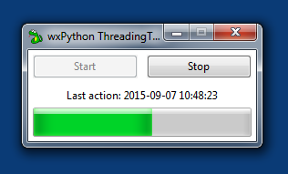

wxPython Threading Template
==========================

This is a basic template for creating Python applications that use [wxPython](http://wxpython.org).

The Python code of the graphical user interface in ``gui.py`` is generated by [wxFormBuilder](http://sourceforge.net/projects/wxformbuilder/) (3.5.0 beta). The editable project file is ``gui.fbp``. Modify this file with WxFormbuilder and select *File*, *Generate code* afterwards.

Upon launch the program waits for the user to push the "Start" button. Then the actual function that is run once, and the counter starts ticking. Always when the gauge hits 0 the function is run again and the counter resets. The user can stop the periodic execution of the function by closing the window or by hitting the "Stop" button. A clean exit is ensured regardless (no thread killing).

Use case: The actual function can be implemented to analyze log files, take screenshots, check for files, check the system load or disk space, ...

Sources
-------

- [wxPython Threading Template on GitHub](https://github.com/geberl/wxpython_threading_template)
- [eberl.se](http://www.eberl.se)